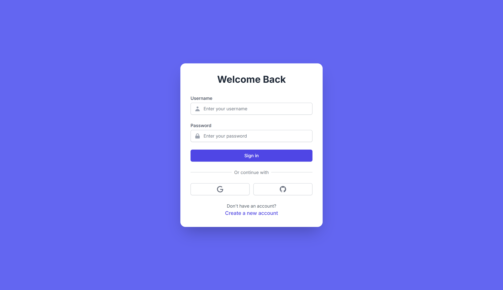
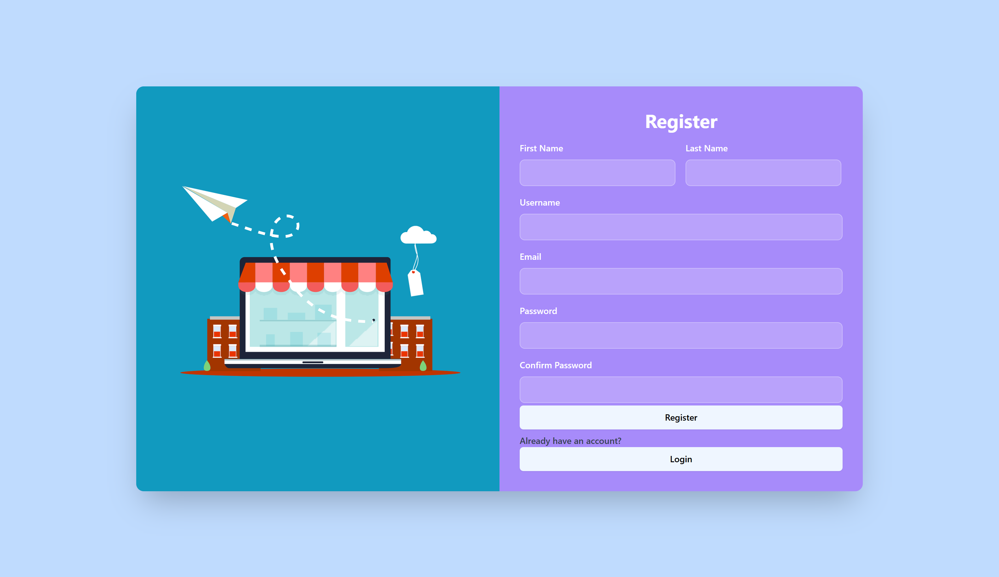
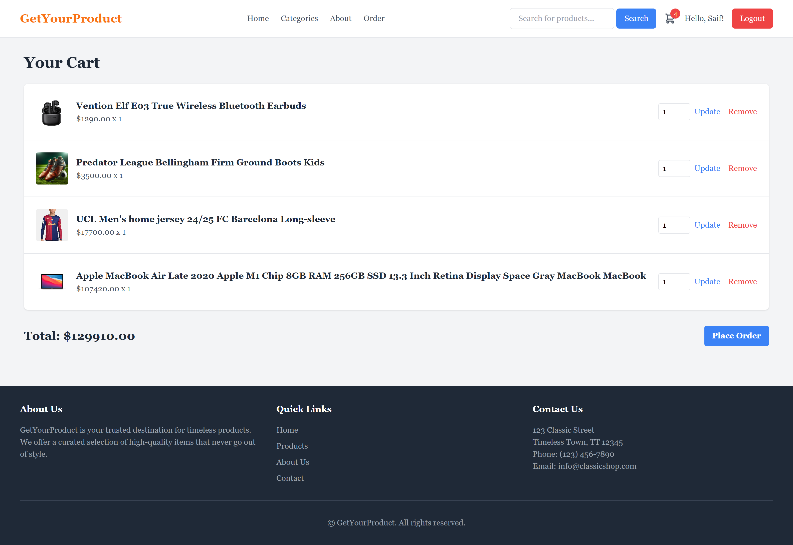
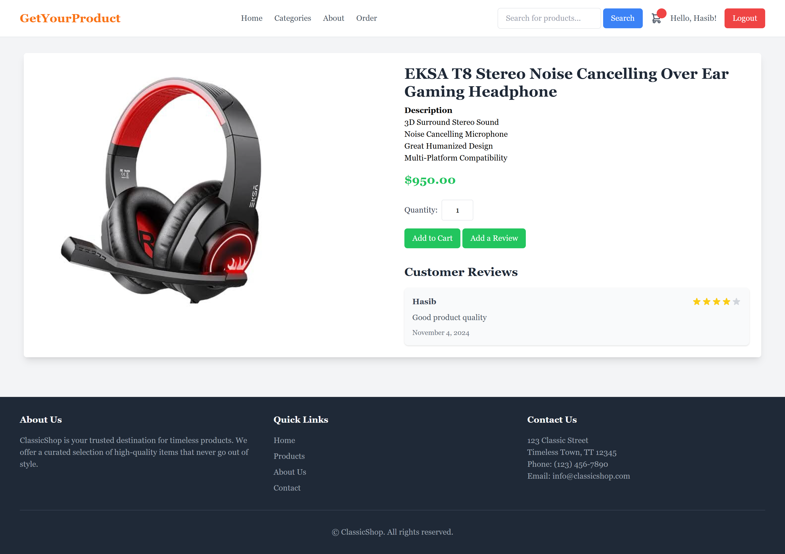
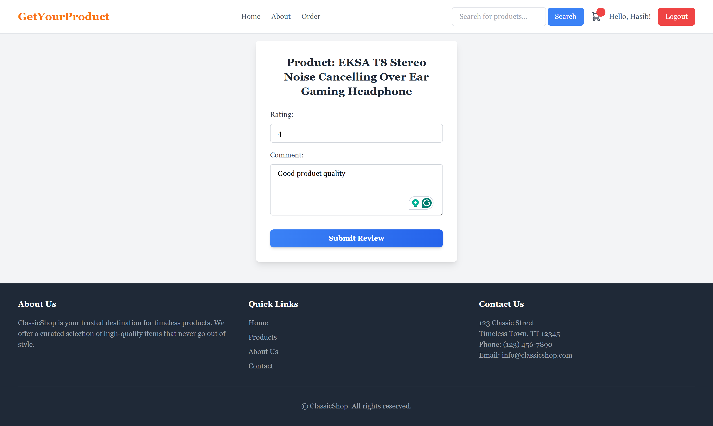
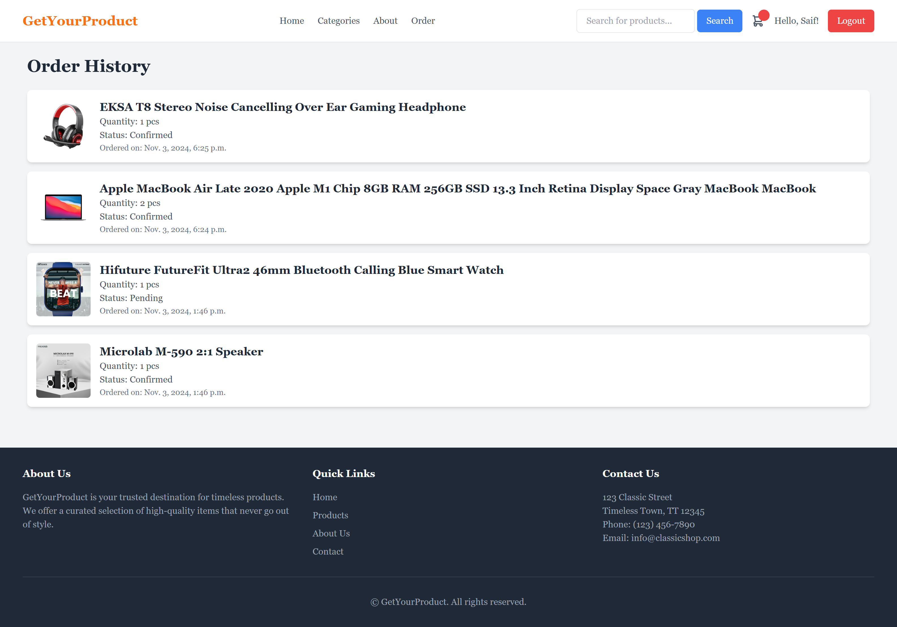
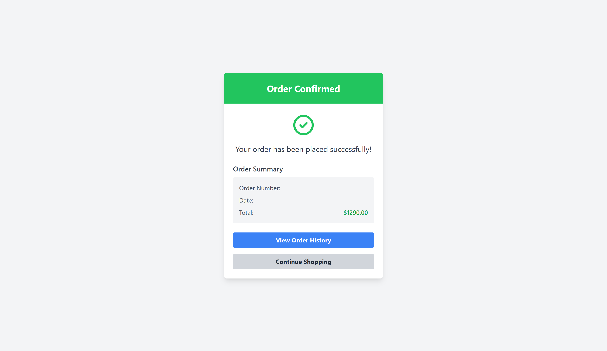
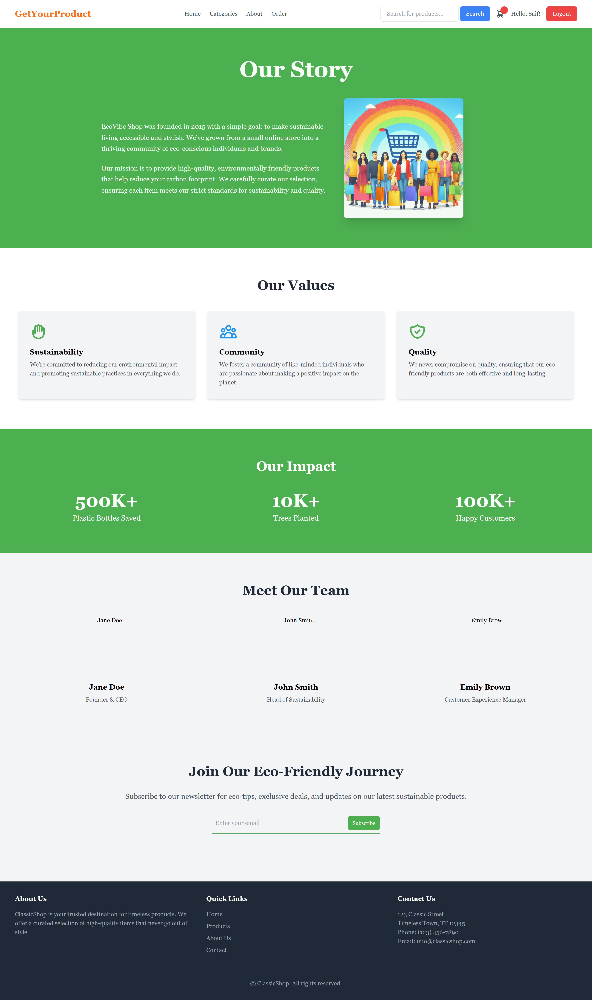
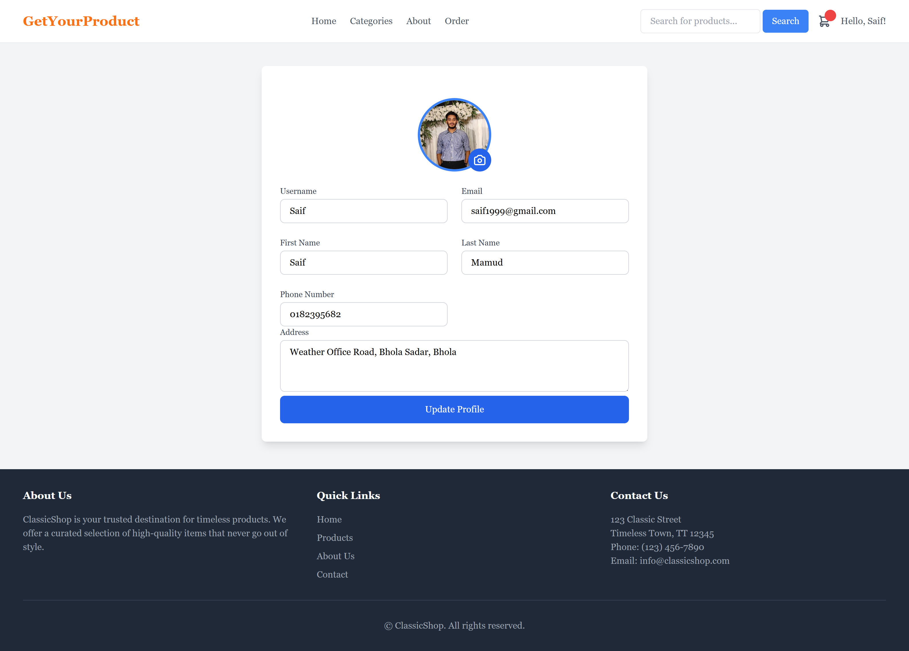

# GetYourProduct

**GetYourProduct** is an e-commerce platform that allows users to browse, search, and purchase products with ease. This project is designed to provide a streamlined online shopping experience, featuring user-friendly navigation, product search functionality, and a simple checkout process.

## Table of Contents

- [Features](#features)
- [Installation](#installation)
- [Usage](#usage)
- [Technologies](#technologies)
- [Contributing](#contributing)
- [License](#license)

## Features

- **Product Browsing**: Explore a wide variety of products across multiple categories.
- **Search Functionality**: Quickly find specific items with an intuitive search bar.
- **User Accounts**: Secure user login and registration system.
- **Cart & Checkout**: Add items to the cart and proceed with a simple checkout process.
- **Review**: User can review the product 
- **Order History & Product Tracking**: Check user order history and the user can track the product.
- **Admin Panel**: Manage products, categories, and orders with an easy-to-use admin interface.

## Usage
- **Register/Login**: Create an account or log in.
- **Browse Products**: Navigate through categories or search for specific items.
- **Add to Cart**: Select desired items and add them to your cart.
- **Checkout**: Complete the checkout process by providing necessary details.

## Technologies
- **Frontend**: HTML, CSS, JavaScript
- **Backend**: Django
- **Database**: SQLite
- **Rich Text Editor**: CKEditor


## Installation

1. Clone the repository:
    ```
    git clone https://github.com/Hasninemamud/GetYourProduct
    ```
2. Install the required dependencies:
    ```
    pip install -r requirements.txt
    ```
3. Apply database migrations:
    ```
    python manage.py migrate
    ```
4. Go to Commerce\settings.py and change email settings ( if using G-Mail setup app specific password ):
    ```
    #Change with your own email and password
    EMAIL_HOST_USER = 'youremail'
    EMAIL_HOST_PASSWORD = 'yourpassword'
    ```
    If using the default email provided please check the spam mails in your email inbox.
5. Start the development server:
    ```
    python manage.py runserver
    ```
## Output Screens

 1. Home Page
 
 2. Login Page
 
 3. Registration Page
 
 4. Cart
 
 5. Product Details
 
 6. Product Review
 
 7. Order History
 
 8. Order Confirm
 
 9. About
 
 10. User Profile
 
 11. Customer Support Chatbot
 


